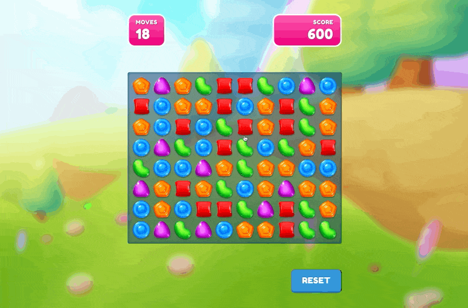

# svelte-match3

A simple match3 game built with Svelte.

**Play here 👉 https://svelte-crush.netlify.app/**

## Demo



## Get started locally

*Note that you will need to have [Node.js](https://nodejs.org) installed.*

Clone this repo and install the dependencies...

```bash
npm install
```

...then start [Rollup](https://rollupjs.org):

```bash
npm run dev
```

Navigate to [localhost:5000](http://localhost:5000). You should see the game running.
